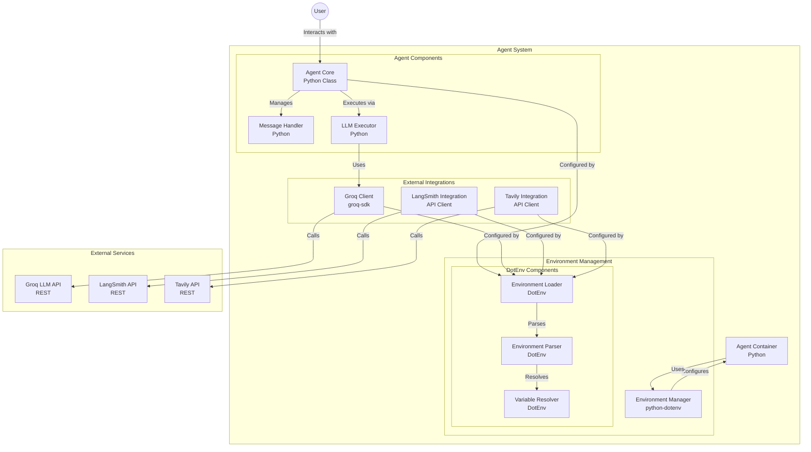

```mermaid
graph TB
    User((User))

    subgraph "Agent System"
        AgentContainer["Agent Container<br>Python"]
        
        subgraph "Agent Components"
            AgentCore["Agent Core<br>Python Class"]
            MessageHandler["Message Handler<br>Python"]
            LLMExecutor["LLM Executor<br>Python"]
        end

        subgraph "Environment Management"
            DotEnvContainer["Environment Manager<br>python-dotenv"]
            
            subgraph "DotEnv Components"
                EnvLoader["Environment Loader<br>DotEnv"]
                EnvParser["Environment Parser<br>DotEnv"]
                VariableResolver["Variable Resolver<br>DotEnv"]
            end
        end

        subgraph "External Integrations"
            GroqClient["Groq Client<br>groq-sdk"]
            LangSmithClient["LangSmith Integration<br>API Client"]
            TavilyClient["Tavily Integration<br>API Client"]
        end
    end

    subgraph "External Services"
        GroqAPI["Groq LLM API<br>REST"]
        LangSmithAPI["LangSmith API<br>REST"]
        TavilyAPI["Tavily API<br>REST"]
    end

    %% Relationships
    User -->|"Interacts with"| AgentCore
    AgentCore -->|"Manages"| MessageHandler
    AgentCore -->|"Executes via"| LLMExecutor
    LLMExecutor -->|"Uses"| GroqClient
    
    DotEnvContainer -->|"Configures"| AgentContainer
    EnvLoader -->|"Parses"| EnvParser
    EnvParser -->|"Resolves"| VariableResolver
    
    GroqClient -->|"Calls"| GroqAPI
    LangSmithClient -->|"Calls"| LangSmithAPI
    TavilyClient -->|"Calls"| TavilyAPI
    
    %% Internal Component Relationships
    AgentContainer -->|"Uses"| DotEnvContainer
    AgentCore -->|"Configured by"| EnvLoader
    GroqClient -->|"Configured by"| EnvLoader
    LangSmithClient -->|"Configured by"| EnvLoader
    TavilyClient -->|"Configured by"| EnvLoader
```